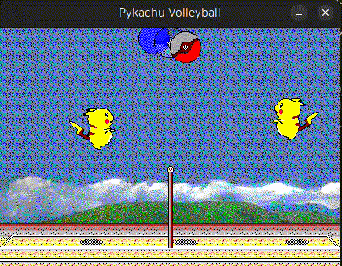

# Pykachu-Volleyball

Pikachu Volleyball `gymnasium` 환경에 표 기반 Q-learning 적용. 표 학습용 밀집 보상 재설계 포함.
[Frog-Slayer/Pykachu-Volleyball](https://github.com/Frog-Slayer/Pykachu-Volleyball) 포크 — 환경은 upstream, 학습 부분이 이 포크에서 추가된 것.

---



## 환경

`gym.make('PykachuVolleyball-v0', render_mode="human", is_player_2_computer=False)`

| | |
|---|---|
| Action Space | `MultiDiscrete([3, 3, 2])` — 좌우 · 상하 · 파워히트 |
| Observation Space | `Box(0, 255, (432, 304, 3), uint8)` — 화면 RGB |
| `step()` 인자 | player 2 (오른쪽) 행동 하나. player 1은 내장 AI |
| `step()` 반환 | `(observation, reward, terminated, info)` — 4-tuple |
| `terminated` | 공이 바닥에 닿으면 `True` |
| `info` | player1 · player2 좌표와 dive_direction, ball 좌표와 속도 |

| 값 | `action_space[0]` 좌우 | `action_space[1]` 상하 | `action_space[2]` 파워히트 |
|---|---|---|---|
| 0 | 왼쪽 | 위 | NOOP |
| 1 | NOOP | NOOP | 파워히트 |
| 2 | 오른쪽 | 아래 | — |

## Q-learning

| 파일 | 내용 |
|---|---|
| `train_qlearning.py` | 학습 후 `q_table.pkl` 저장, reward·epsilon 곡선 |
| `test_qlearning.py` | `q_table.pkl` 로드, greedy 5 에피소드 |
| `q_table.pkl` | 학습된 Q-table |
| `sample.py` | upstream 랜덤 행동 예제 |

- **상태** — 관측이 432×304×3 RGB라 표에 부적합. `info`의 좌표를 20px 격자로 이산화
  ```python
  state = (ball.x // 20, ball.y // 20, player2.x // 20, player2.y // 20)
  ```
  Q-table은 이 4-tuple을 키로 18개 행동(3×3×2)에 매핑. 미방문 상태는 지연 생성
- **보상** — upstream은 승 `+1` / 패 `-1`. 표 학습에는 신호가 희소해 밀집 보상으로 교체

  | 항목 | 값 | 목적 |
  |---|---|---|
  | 승 / 패 | `+15` / `-10` | 주 목표 |
  | 랠리 | `+0.1`/step | 공 유지 |
  | 이동 | `+0.01 × 거리` | 정지 억제 |
  | 타격 | `+1.0` | 공 접촉 |
  | 근접 | `+0.1 / 거리` | 공 방향 기울기 |

- **하이퍼파라미터** — `alpha` 0.1 · `gamma` 0.95 · `epsilon` 1.0에서 0.999 감쇠, 하한 0.1 · 10,000 에피소드

## 실행

```bash
pip install -e .
pip install matplotlib

python train_qlearning.py
python test_qlearning.py
```

두 스크립트 모두 `render_mode="human"` + step당 `time.sleep(0.02)`. 10,000 에피소드는 매우 오래 걸리므로 표만 필요하면 sleep과 렌더러 제거.

## 한계

- **상태가 Markov 아님.** 좌표만 보유하고 `info`가 제공하는 `ball.x_velocity` · `ball.y_velocity`를 버림. 다가오는 공과 멀어지는 공이 같은 상태로 취급되나 필요한 행동은 반대. 속도 이산화 추가가 가장 유효한 개선
- **결과 미측정.** reward·epsilon 곡선만 그리고 저장·요약 없음. 내장 AI 상대 승률 미측정, `q_table.pkl`에 대응하는 점수 없음
- **학습 중 렌더링.** step당 0.02초로 10,000 에피소드는 비현실적. 배포된 표는 그보다 적은 학습량
- **보상 항의 상충 가능성.** step당 `+0.1` 랠리 보너스는 랠리 연장을 보상하나 승리와 다름. `+0.1 / 거리` 근접 항은 접근할수록 무한 증가. 가중치 미조정
- **`step()`이 4-tuple 반환.** gymnasium 표준 `(obs, reward, terminated, truncated, info)`가 아니라 Stable-Baselines3 등 표준 RL 라이브러리에서 그대로 사용 불가

## Upstream TODO

- [x] reset · reward
- [x] Python 관례 리팩터링
- [x] 배경 렌더링
- [x] 피카츄 배경 투명 처리
- [x] trail · punch · hyper 스프라이트
- [x] 컴퓨터 이동 보정
- [x] 공 회전
- [x] 그림자 렌더링
- [ ] `render_mode='rgb_array'` 지원
- [ ] 주석 보강
- [ ] 사운드 (선택 적용)
